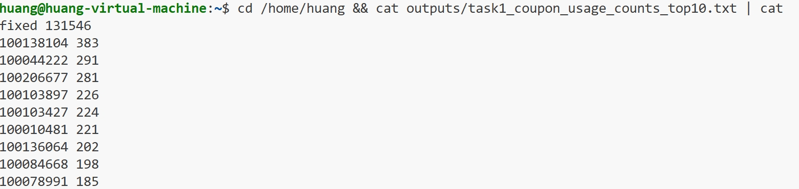
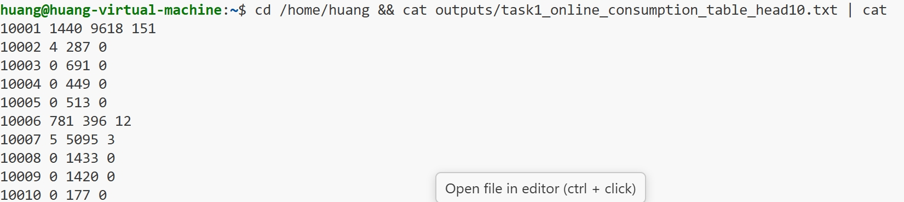
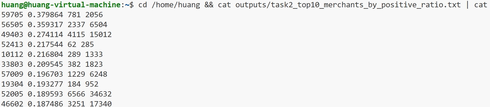
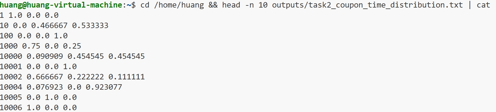
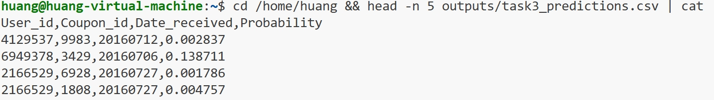
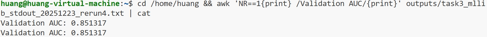

# 实验4：Spark 编程实验报告

## 1. 实验目的

- 熟悉 Spark RDD 基础算子（`map` / `filter` / `reduceByKey` / `sortBy` 等）
- 熟悉 Spark SQL/DataFrame 的聚合分析能力
- 使用 MLlib 完成一个二分类预测任务并输出预测概率

## 2. 实验环境与数据说明

### 2.1 环境

- OS：Linux (Ubuntu 22.04)
- Java：OpenJDK 1.8
- Spark：3.5.1（本地 `local[*]`）

### 2.2 数据

- 在线训练集：`ccf_online_stage1_train.csv.gz`
- 离线训练集：`ccf_offline_stage1_train.csv.gz`
- 离线测试集：`ccf_offline_stage1_test_revised.csv`

说明：CSV 中空值以字符串 `null` 表示；日期字段格式为 `yyyyMMdd`。

### 2.3 工程结构

- `spark_lab/common.py`：SparkSession 构建、路径/空值处理、输出工具
- `spark_lab/task1_*`：RDD 任务
- `spark_lab/task2_*`：Spark SQL 任务
- `spark_lab/task3_*`：MLlib 预测任务
- `outputs/`：题目要求的输出附件

## 3. 运行方式

假设你的 Spark 可执行为：`$SPARK_HOME/bin/spark-submit`。

按题目顺序执行：

```bash
$SPARK_HOME/bin/spark-submit spark_lab/task1_rdd_coupon_usage.py
$SPARK_HOME/bin/spark-submit spark_lab/task1_rdd_merchant_consumption.py
$SPARK_HOME/bin/spark-submit spark_lab/task2_sql_coupon_time_distribution.py
$SPARK_HOME/bin/spark-submit spark_lab/task2_sql_merchant_positive_ratio.py
$SPARK_HOME/bin/spark-submit spark_lab/task3_mllib_predict.py
```

## 4. 任务一：RDD 编程

### 4.1 题目 1：统计每种优惠券被使用次数

**设计思路**

- 读取在线数据 RDD（跳过表头）
- “使用”定义：`Coupon_id != null` 且 `Date != null`
- 以 `Coupon_id` 为 key 做 `reduceByKey` 计数，再按次数降序排序

**核心代码片段**（来自 `spark_lab/task1_rdd_coupon_usage.py`）

```python
rdd = sc.textFile(ONLINE_TRAIN_PATH)
header = rdd.first()

def parse(line: str):
    if line == header:
        return None
    parts = line.split(",")
    if len(parts) < 7:
        return None
    coupon_id = parts[3]
    date = parts[6]
    if coupon_id == "null" or date == "null":
        return None
    return coupon_id

counts = (
    rdd.map(parse)
    .filter(lambda x: x is not None)
    .map(lambda cid: (cid, 1))
    .reduceByKey(lambda a, b: a + b)
    .sortBy(lambda kv: kv[1], ascending=False)
)
```

**运行截图**



### 4.2 题目 2：统计每个商家三类样本数

**三类样本定义（基于在线数据）**

- 负样本：`Date = null` 且 `Coupon_id != null`（领券未用）
- 普通消费：`Date != null` 且 `Coupon_id = null`（无券消费）
- 正样本：`Date != null` 且 `Coupon_id != null`（用券消费）

**设计思路**

- 映射为 `(Merchant_id, (neg, normal, pos))`
- `reduceByKey` 汇总三元组
- 排序后写入 Hive 表 `online_consumption_table`，并导出 CSV 作为附件

**核心代码片段**（来自 `spark_lab/task1_rdd_merchant_consumption.py`）

```python
negative = 1 if (date == "null" and coupon_id != "null") else 0
normal = 1 if (date != "null" and coupon_id == "null") else 0
positive = 1 if (date != "null" and coupon_id != "null") else 0
return mid, (negative, normal, positive)

merged = (
    rdd.map(parse)
    .filter(lambda x: x is not None)
    .reduceByKey(lambda a, b: (a[0] + b[0], a[1] + b[1], a[2] + b[2]))
    .sortByKey(ascending=True)
)

# 保存为 Hive 表
df.write.mode("overwrite").saveAsTable("online_consumption_table")
```

**运行截图**



## 5. 任务二：Spark SQL 编程

### 5.1 题目 1：按优惠券统计使用日期在上/中/下旬分布

**设计思路**

- 使用离线训练数据
- 仅统计 `Coupon_id` 与 `Date`（实际使用日期）都非空的记录
- 提取 `dayofmonth(Date)`，分别统计：1-10、11-20、21-31 的比例

**核心代码片段**（来自 `spark_lab/task2_sql_coupon_time_distribution.py`）

```python
used = (
    df.select(
        F.col("Coupon_id").alias("Coupon_id"),
        F.to_date(F.col("Date"), "yyyyMMdd").alias("use_date"),
    )
    .where(F.col("Coupon_id").isNotNull() & F.col("use_date").isNotNull())
    .select("Coupon_id", F.dayofmonth("use_date").alias("d"))
)

dist = (
    used.groupBy("Coupon_id")
    .agg(
        (F.sum(F.when((F.col("d") >= 1) & (F.col("d") <= 10), 1).otherwise(0)) / F.count("*")).alias("p_early"),
        (F.sum(F.when((F.col("d") >= 11) & (F.col("d") <= 20), 1).otherwise(0)) / F.count("*")).alias("p_mid"),
        (F.sum(F.when(F.col("d") >= 21, 1).otherwise(0)) / F.count("*")).alias("p_late"),
    )
)
```

**运行截图**



### 5.2 题目 2：计算每个商家的正样本比例并输出 Top10

**设计思路**

- 读取任务一生成的 Hive 表 `online_consumption_table`
- 正样本比例：

$$
\text{pos\_ratio} = \frac{\text{Positive}}{\text{Negative} + \text{Normal} + \text{Positive}}
$$

- 按 `pos_ratio` 降序（再按 `pos_cnt` 降序）取 Top10

**核心代码片段**（来自 `spark_lab/task2_sql_merchant_positive_ratio.py`）

```python
table = spark.table("online_consumption_table")

ranked = (
    table.select(
        F.col("Merchant_id").alias("Merchant_id"),
        F.col("Positive").cast("double").alias("Positive"),
        (F.col("Negative") + F.col("Normal") + F.col("Positive")).cast("double").alias("Total"),
    )
    .where(F.col("Total") > 0)
    .select(
        "Merchant_id",
        (F.col("Positive") / F.col("Total")).alias("pos_ratio"),
        F.col("Positive").cast("long").alias("pos_cnt"),
        F.col("Total").cast("long").alias("total_cnt"),
    )
    .orderBy(F.col("pos_ratio").desc(), F.col("pos_cnt").desc(), F.col("Merchant_id").asc())
    .limit(10)
)
```

**运行截图**



## 6. 任务三：MLlib 预测

### 6.1 任务目标

使用离线训练数据训练二分类模型，预测测试集中（2016-07）每条“领券记录”在 15 天内用券的概率，并输出 `User_id, Coupon_id, Date_received, Probability`。

### 6.2 标签与特征

**标签定义**

- 仅使用“领券样本”（`Coupon_id`、`Date_received` 非空）
- 标签：若 `Date` 非空且 `Date - Date_received` 在 `[0, 15]` 天内，则为 1，否则为 0

**特征工程（示例）**

- 数值：`Distance`（空置为 -1）、折扣 `Discount_rate`（含满减解析）、领取日期的 day/day-of-week
- 类别：`User_id`/`Merchant_id`/`Coupon_id` 使用 `FeatureHasher`

**核心代码片段**（来自 `spark_lab/task3_mllib_predict.py`）

```python
train = train_raw.where(F.col("Coupon_id").isNotNull() & F.col("Date_received").isNotNull())

train = train.withColumn(
    "label",
    F.when(
        F.col("use_date").isNotNull()
        & (F.datediff(F.col("use_date"), F.col("recv_date")) <= 15)
        & (F.datediff(F.col("use_date"), F.col("recv_date")) >= 0),
        F.lit(1.0),
    ).otherwise(F.lit(0.0)),
)

feature_hasher = FeatureHasher(
    inputCols=["User_id", "Merchant_id", "Coupon_id"],
    outputCol="hashed",
    numFeatures=1 << 18,
)

lr = LogisticRegression(maxIter=50, regParam=0.01)
model = Pipeline(stages=[feature_hasher, assembler, lr]).fit(train_df)
```

### 6.3 模型验证与输出

- 验证方式：训练集随机划分 8:2
- 指标：AUC

**运行截图（AUC）**



**运行截图（预测文件）**



## 7. 附件结果清单（outputs/）

- Task1-1：`outputs/task1_coupon_usage_counts.txt`、`outputs/task1_coupon_usage_counts_top10.txt`
- Task1-2：`outputs/task1_online_consumption_table.csv`、`outputs/task1_online_consumption_table_head10.txt`
- Task2-1：`outputs/task2_coupon_time_distribution.txt`
- Task2-2：`outputs/task2_top10_merchants_by_positive_ratio.txt`
- Task3：`outputs/task3_predictions.csv`（预测结果）
